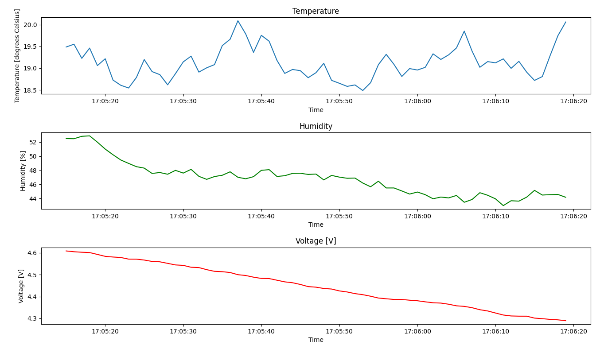

# Working with databases
Some working with databases. We are simulating fetching (generate) data from virtual sensors and save it to the database. You can generate probes indefinitely and visualize it on plots.

## Used modules and database
* own ini parser ``iniparser.py``
* pymysql
* matplotlib
* pandas
* time, datetime, random
* database: MariaDB 10.11.2


## Features
 * set connection credentials in configuration ``config.ini`` file
 * configure device (device ID, measurement interval and database insert interval) in ``config.ini``
 * ``.ini`` files parser included

## Configuration
Before running the program, set the connection credentials to your database in ``config.ini``:
```ini
[DATABASE]
host = localhost
port = 3306
user = root
password = admin123
database = iot

[DEVICE]
id = 1
measurement_time = 1
database_insert_time = 5
```

## Usage
1. First, you must initialize the database and tables, just run ``build.py``:
```commandline
py build.py
```

2. If you want to "transmit" (generate) probes, just run ``write.py``:
```commandline
py write.py
```

Output example:
```commandline
Time: 2023-03-24 17:00:13, Voltage: 4.6785922103845605, Temperature: 22.118619375631294, Humidity: 67.97570192272936
Time: 2023-03-24 17:00:14, Voltage: 4.671061121227456, Temperature: 21.95474097991457, Humidity: 67.44150330040397
Time: 2023-03-24 17:00:15, Voltage: 4.661317188385993, Temperature: 22.101562549713925, Humidity: 67.36695832087837
Time: 2023-03-24 17:00:16, Voltage: 4.655049775371927, Temperature: 22.269548046210897, Humidity: 67.7397553239526
Time: 2023-03-24 17:00:17, Voltage: 4.652538192657195, Temperature: 22.151960279119283, Humidity: 66.78441772210377
Added data to the database
```

3. If you want to show saved probes from database, just run ``print.py``.
It will give you transposed array (as DataFrame) and plots:
```commandline
Transposed array to DataFrame:
                  time  temperature  humidity  voltage
0  2023-03-24 17:05:15      19.4861   52.4846  4.60856
1  2023-03-24 17:05:16      19.5501   52.4677  4.60494
2  2023-03-24 17:05:17      19.2256   52.8077  4.60260
3  2023-03-24 17:05:18      19.4613   52.8731  4.60116
4  2023-03-24 17:05:19      19.0597   51.9769  4.59263
..                 ...          ...       ...      ...
60 2023-03-24 17:06:15      18.7191   45.1461  4.30127
61 2023-03-24 17:06:16      18.8072   44.4812  4.29866
62 2023-03-24 17:06:17      19.2888   44.5397  4.29540
63 2023-03-24 17:06:18      19.7464   44.5661  4.29333
64 2023-03-24 17:06:19      20.0597   44.1671  4.28941
```

