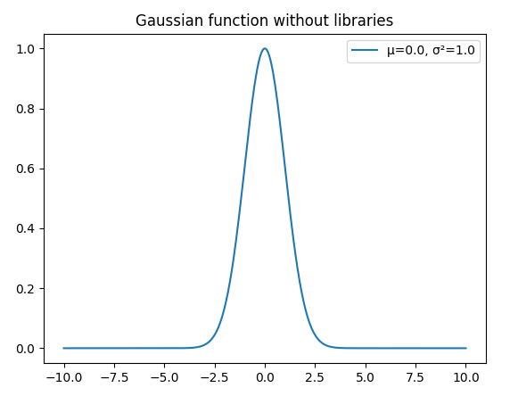
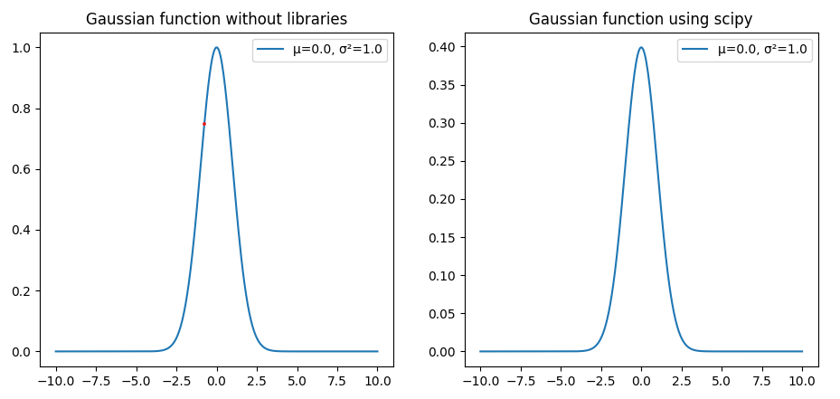
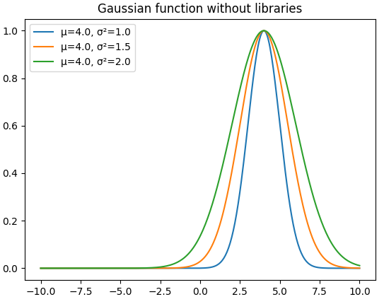

# Gaussian function task

Solved task from: https://github.com/Xaeian/LabPython/blob/main/np.md.

Used modules:
* argparse
* matplotlib
* scipy

# Explanations
* variance have higher priority than standard deviation
* --min and --max params have higher priority than -r

# How to run task
Just uncomment task at the end of file:
```python
# first_task()
# second_task()
third_task()
```

# Usage
## First version
* Takes user parameters from console
* You can only type one value of each parameter
Example:
```commandline
Type variation: 0
Type standard deviation: 1
Type average: 0
Type min value of the range: 10
Type max value of the range: 10
```
For those parameters we have this chart:


## Second version
* Same as first version, but it also draw gaussian function using scipy.stats

Example chart:


## Third version
* Similar to first version, but it takes arguments using argparse
* You can type multiple values for variance, standard deviation and mean
Example:
```commandline
py main.py -s 1 1.5 2 -u 4
py main.py -s 1.5 -u 3 4 5
py main.py -s 7 2 -u 5 4 3
```
Example chart:

