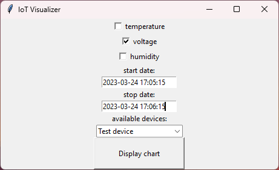
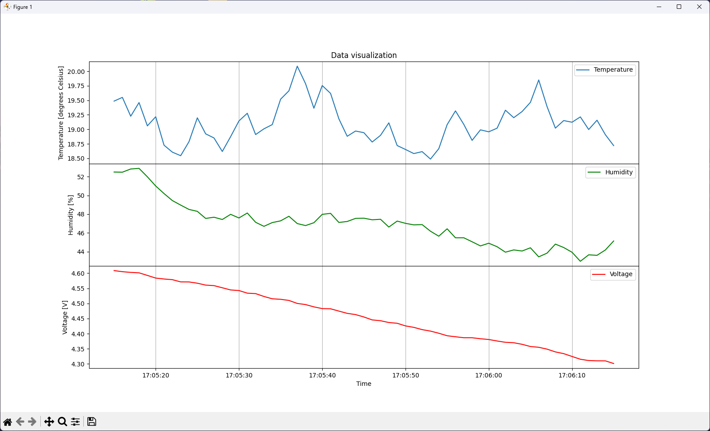

# Tkinter
Extended version of [databases](https://github.com/krzysztofhewelt/python-tasks/tree/main/databases) task. Added window where we're choosing types of measurements, device and time range, and visualizing it on the charts.
We're using data from database used in previous task, filled with sample probes. 

## Used modules and database
* extended version of "databases" task
* modules: same as "databases" task and: Tkinter

## Features
 * same as "databases" task
 * you can choose which type/types of measurement you want to visualize it on charts
 * show data with given time range
 * show data for specific device

## Usage
Just run ``main.py``:
```commandline
py main.py
```

If you want to change the database credentials or generate probes, see [databases](https://github.com/krzysztofhewelt/python-tasks/blob/main/databases/README.md).

## Screenshots

